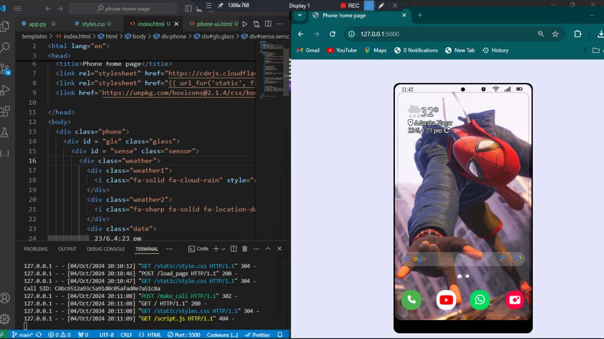

# Twilio Phone UI Application

This project is an interactive smartphone UI built with HTML, CSS, JavaScript, and Python (Flask). The user can enter a phone number and make calls using the Twilio service. It simulates a phone's home screen where the call functionality is embedded with an intuitive design.

## Features

- **Responsive smartphone interface**: The app presents a realistic phone UI, complete with icons and widgets.
- **Phone call functionality**: Users can input a phone number to make calls using the Twilio API. 
- **Weather and time widget**: Weather and clock display are included to enhance the UI.
- **Tech stack**: Built using Python (Flask), HTML, CSS, and JavaScript.

  


## Note

- This code currently supports recorded calls only, which you can replace with your own pre-recorded audio.

- You can also enable real-time live calls and interact with people by integrating additional JavaScript logic. For more details, please visit the official  [Twilio](https://www.twilio.com/) website.

## Requirements

Before running the application, ensure you have the following installed:

- Python 3.x
- Flask (`pip install flask`)
- Twilio (`pip install twilio`)

## Setup Instructions

1. Clone the repository:
    ```bash
    git clone https://github.com/BikramMondal5/Twilio-phone.git
    ```
2. Navigate to the project directory:
    ```bash
    cd Twilio-phone
    ```
3. Create a new Twilio account and get your twilio account sid, auth-token and phone number. 
4. Set up environment variables for Twilio in a `.env` file:
    ```bash
    TWILIO_ACCOUNT_SID=your_account_sid
    TWILIO_AUTH_TOKEN=your_auth_token
    TWILIO_PHONE_NUMBER=your_twilio_number
    ```
5. Run the Flask app:
    ```bash
    python app.py
    ```
6. Open your browser and navigate to `http://127.0.0.1:5000/`.

## Usage

1. After running the app, you'll see a smartphone UI on the screen.
2. After click on the phone icon, you're redirect to a phone dialer UI where you can enter the phone number you want to call.
3. Click the call button, and the app will make the call using Twilio services.

## Credits

Special thanks to [Twilio](https://www.twilio.com/) for their amazing API, which powers the call functionality in this application.

## Contribution
   
   Feel free to fork this repository, raise issues, or submit pull requests to add features or improve the design.
   
   ## License
   
   This project is licensed under the `MIT License`.
